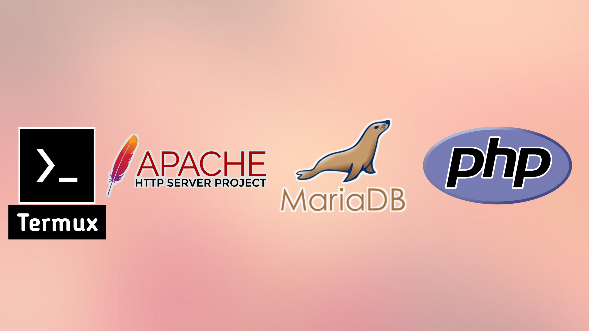

## TAMP Server

TAMP Server for Android/ Operating System or Mobile 📱 and Laptops  💻 



* T for Termux App.
* A for Apache Web Server.
* M for MariaDB database.
* P for PHP Language.

### How to install
Step 1: First of all we are update and upgrade our Termux App packages and repositories.
```bash
apt update && apt upgrade -y
```
Step 2: We are install those packages.
```bash
apt install php php-apache apache2 mariadb phpmyadmin -y
```
if you want to install Composer and SMTP library than try this:
```bash
apt install composer msmtp -y
```

### PHP and Apache Web Server Configuration.
* First of all we are import our `PHP module` from `libexec`.
* So we are changing our Apache `httpd.conf` file.
```bash
vi $PREFIX/etc/apache2/httpd.conf
```
* Go to line number 65
* put this line of code in your `httpd.conf` file.

```conf
65 LoadModule php_module libexec/apache2/libphp.so
```
* Remove # (Uncomment) from line number 66 `mpm_prefork_module`.
* Add # (commented) from line number 67 `mpm_worker_module`.

Full code here:

```conf
63 Example
64 # LoadModule foo_module modules/mod_foo.so
65 LoadModule php_module libexec/apache2/libphp.so
66 LoadModule mpm_prefork_module libexec/apache2/mod_mpm_prefork.so
67 # LoadModule mpm_worker_module libexec/apache2/mod_mpm_worker.so
68
```

### PHP files Configuration.
* Scrolldown in your Apache's `httpd.conf` file.
* Add this line of code in your `httpd.conf` file.

```conf
532
533   <FilesMatch \.php$>
534      SetHandler application/x-httpd-php
535   </FilesMatch>
536
537 Include etc/apache2/extra/php_module.conf
538
```

### PHPMyAdmin Configuration.
* We are need to change some line of code from our phpmyadmin's `config.inc.php` file.
```bash
vi $PREFIX/etc/phpmyadmin/config.inc.php
```
* First of all we need a 32 bytes secret code, because we are safe our database from hackers and attackers.

```php
16 $cfg['blowfish_secret'] = '7yRxkscr/SB4Sb729H7HdnbNqZxJOQ==';
```

* A little bits scrolldown than we are getting this of code:

```php
27 /* Authentication type */
28 $cfg['Servers'][$i]['auth_type'] = 'cookie';
29 /* Server parameters */
30 $cfg['Servers'][$i]['host'] = 'localhost';
31 $cfg['Servers'][$i]['port'] = '3306';
32 $cfg['Servers'][$i]['compress'] = false;
33 $cfg['Servers'][$i]['AllowNoPassword'] = true;
34 $cfg['Servers'][$i]['socket'] = '/var/run/mysqld.sock';
```
* Everything is changes than we are access our database through the phpmyadmin.
* if you want to opne PHPMyAdmin than [click here](http://localhost:8080/phpmyadmin/).
* username is `root` and password is blank(password not set by default).


### SMTP Configuration.
* First of all we need our `php.ini` file.
* So we are create our `php.ini`.
* following this command on your Termux/terminal `touch php.ini`.
```bash
vi $PREFIX/lib/php.ini
```
* add this line of code in your `php.ini` file.
```php
sendmail_path = "/bin/msmtp -C /etc/.msmtprc -t"
```
* We are create our `.msmtprc` file.
```bash
vi $PREFIX/etc/.msmtprc
```
* Following of this code:
```bash
account default
host smtp.gmail.com
port 587
from # your email
auth on
user # your email
password # secret code
tls on
tls_starttls on
tls_trust_file /etc/tls/cert.pem
```

### Support me!

<iframe src="https://github.com/sponsors/Ashishkumbhar01/card" title="Sponsor Ashishkumbhar01" height="225" width="600" style="border: 0;"></iframe>